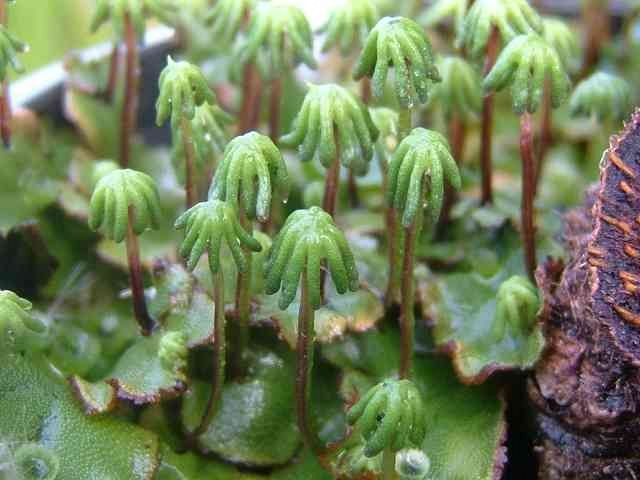

# This species is the most environmentally friendly and therefore widespread.

A varied marching can be found on moist soil in forests, in places of fires, bonfires, along the banks of forest rivers, streams, along the bottom of hollows and forest ravines.

The thallus has the form of a flat ribbon-like plate, the sections of which are divided in two, that is, they branch twice (dichotomously).

The upper side of the thallus is dark green; under it, air cavities (peculiar chambers) develop, penetrated with dark green multicellular branched filaments containing chloroplasts. Photosynthesis is carried out in such threads. The stomata are located in the upper layer of cells.
 
From the lower layer of cells, two types of rhizoids depart - simple and reed. The narrow reed rhizoids have a very curious structure: their inner walls have protrusions in the form of reeds. Along the reed rhizoids, as if by wicks, water molecules rise from the soil to all the cells of the thallus. Reed rhizoids are pressed tightly to the soil with the help of special outgrowths - scales.

The march is diverse - the plant is dioecious. On some specimens, by the summer, peculiar outgrowths develop in the form of a multi-blade disk sitting on a leg. This formation is called the male stand. Other specimens of the marschania have outgrowths, the legs of which are crowned with plates that look like multi-ray stars. These are female coasters (see figure of the textbook, p. 51).

Both female and male supports are modified branches of the thallus, which in the course of evolution have adapted to form antheridia and archegonium on them.

In the presence of drip-liquid moisture in the form of rain or dew, fertilization occurs, as a result of which an asexual generation is formed - a sporophyte, or sporogon. A mature sporogon has the shape of a spherical box with a thin stem.

Here is an interesting bryophyte plant marshantia.
